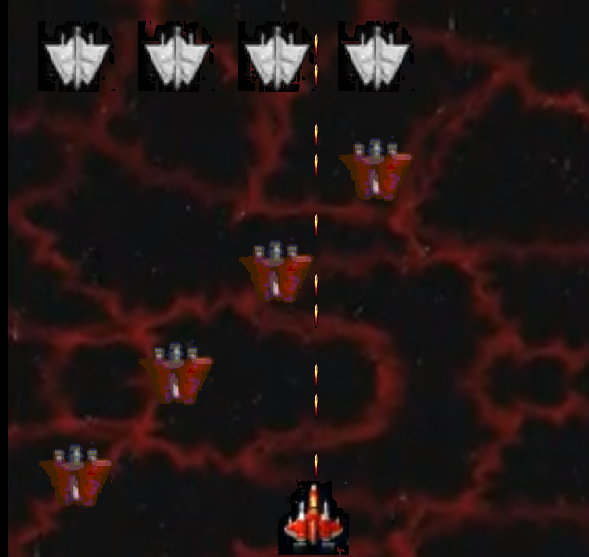

# Raiden Lite

Raiden Lite is a simplified yet enjoyable version of the classic game Raiden. It was implemented in C++ and built with Visual Studio 2017. In this game, the fighter will automatically fire, allowing you to focus solely on maneuvering through the intense battles.

## Features

- Simple and addictive gameplay.
- Smooth controls using arrow keys to move.
- Automatic firing by the fighter.
- Engaging and challenging levels.

## Directory Structure

The project's directory structure is organized as follows:

## Directory Structure

| Directory | Description                  |
|-----------|------------------------------|
| bin      | Compiled executable file     |
| src      | Source files                 |

## How to Play

1. Use the arrow keys to navigate your fighter through the game environment.
2. Dodge enemy attacks and obstacles to survive.
3. Your fighter will automatically fire at enemies, so focus on avoiding collisions.
4. Collect power-ups and bonuses to enhance your fighter's abilities.
5. Complete levels by defeating the end-of-level bosses.

## Getting Started

To run Raiden Lite on your system, follow these steps:

1. Clone the repository or download the source code.
2. Open the project in Visual Studio 2017 or a compatible C++ development environment.
3. Build the project to generate the executable file.
4. Locate the compiled executable file in the `bin/` directory.
5. Double-click the executable file to start the game.

## License

This project is licensed under the [MIT License](LICENSE). Feel free to modify and distribute the game as per the terms of the license.

## Acknowledgements

- The original Raiden game for inspiring this project.
- Visual Studio 2017 for providing a robust development environment.
- The C++ programming language and its supportive community.

Enjoy playing Raiden Lite! If you encounter any issues or have suggestions for improvements, please feel free to open an issue or contribute to the project.

